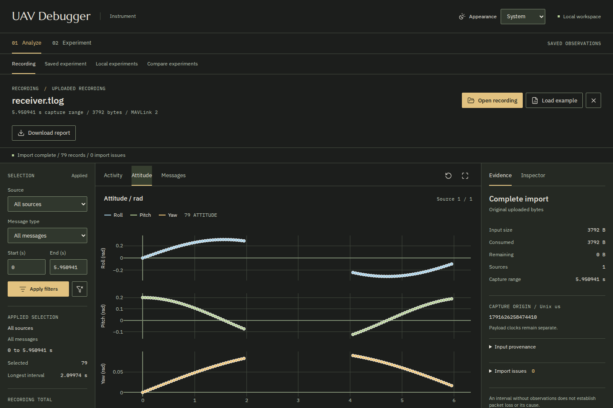
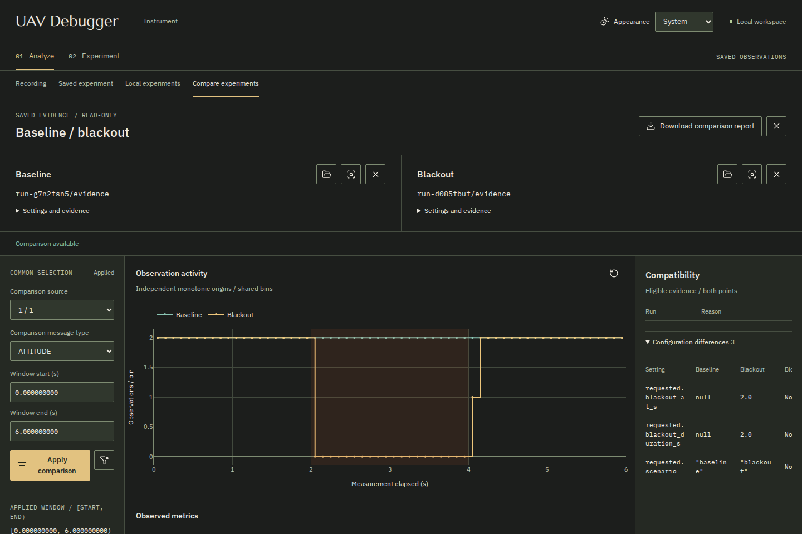

# UAV Debugger

**Work in progress — V1 is not ready yet.**

The goal is to make it easier to investigate a drone's behavior from its
recordings and compare what happens in controlled experiments.

The current prototype brings charts, recorded measurements and original messages
into one workspace. Some parts already work, including inspecting a supported
recording and comparing a normal telemetry stream with an interrupted one.
There is still work to do before these become a usable first version of the
debugger. The screenshots and examples below show progress so far.



*The current prototype inspecting roll, pitch and yaw from a synthetic experiment.
The gap is a deliberate interruption in message forwarding, not a recorded flight.*

## What exists so far

- **Inspect a recording.** Filter by vehicle source, message type and time. Look
  at the charts, then open a message to see its decoded fields and original bytes.
- **Run an experiment.** Send synthetic telemetry through a local relay, with or
  without an interruption. Record what reaches each side of the relay.
- **Compare two runs.** Look at the same interval in a baseline and an interrupted
  run, including message counts, timing and the interruption that actually occurred.
- **Keep the findings.** Export a Markdown report with the selected data,
  recording details and limits of the analysis.

The prototype is organized around two workflows, **Analyze** and **Experiment**.
The implemented analysis can be tried without a drone, simulator or ARGOS
installation. It supports a limited recording format and does not automatically
explain a problem: a gap between selected messages does not tell you its cause.

## Try the prototype locally

These steps let you explore the current development version and its small
synthetic example. Setup, supported inputs and workflows may change before V1.

The checked runtime is **Linux with Python 3.12**. Install
[uv](https://docs.astral.sh/uv/getting-started/installation/), then:

```sh
git clone https://github.com/victormonnot/UAV-Debugger.git
cd UAV-Debugger
uv sync --locked
uv run --locked uav-debugger-instrument
```

Open **http://127.0.0.1:8765** and click **Load example**. The included synthetic
recording has 12 messages from two sources; no download or vehicle connection
is needed to try it after installation.

To inspect a gap, select source **1 / 1**, message type **ATTITUDE**, start **1**
and end **5**, then click **Apply filters**. Open **Attitude** to see the two
observations, four seconds apart. Click a plotted point or a row in **Messages**
to inspect the original record. **Download report** saves the current analysis.
The fixture intentionally includes five repeated-timestamp warnings.

Use **Open recording** for your own supported file. Stop the server with
**Ctrl-C**. The [Analyze guide](docs/analyze.md) covers filters, reports, alternate
ports and access through SSH.

## Run a local Experiment

Choose **Experiment**, keep **Synthetic** and the default six-second duration,
then click **Start experiment**. Once it finishes, choose **Use as baseline**.
Repeat with the **Blackout** scenario, choose **Use as blackout**, then
**Compare selected runs**. The default interruption lasts two seconds.



*Two local UDP experiments compared over the same interval. The chart shows
messages received; both runs use artificial attitude signals.*

**Open in Analyze** opens either saved run for closer inspection. Results stay
in `local/experiments/`; **Local experiments** lets you reopen them after a
restart. **Stop experiment** requests an orderly stop. Changing tabs or
closing the browser lets the bounded run continue.

These scenarios exchange real messages on the computer's loopback network.
They do not simulate flight dynamics or connect to an aircraft. An optional
[ArduCopter SITL source](docs/sitl.md) supplies simulator telemetry and requires
separate setup. The experiment does not arm or command that autopilot.

The same synthetic scenarios are available from the command line. Each needs
a new output directory:

```sh
uv run --locked uav-debugger-experiment --output local/experiments/baseline --scenario baseline
uv run --locked uav-debugger-experiment --output local/experiments/blackout --scenario blackout
```

See the [Experiment guide](docs/experiment.md) for configuration and output files,
and the [comparison guide](docs/comparison.md) for how the results are measured.
[Media details](docs/media/README.md) describe the screenshots above.

## Current input support

UAV Debugger currently reads a specific **QGroundControl-style timestamped MAVLink
format**. A `.tlog` extension alone does not guarantee compatibility. Input
captures are limited to **10 MiB**, and saved experiments to **64 MiB per run**.
These are input limits, not a guarantee of memory use or performance.

The importer preserves capture timestamps, original bytes and unsupported message
IDs. Capture time and timestamps reported by the vehicle remain distinct.
Damaged or unsupported records stop traversal with an explicit issue and the
original remainder retained. The [importer guide](docs/importer.md) specifies
the byte layout and decoding support; [recording validation](docs/recording-validation.md)
documents the public recording checked so far and its partial message coverage.

## Instrument workspace

**Instrument** is the current HTML/CSS/JavaScript interface, backed by Python.
It runs locally, with charts, fonts and icons served by the same process.
Recordings remain unchanged. Tabs keep their own analysis selections; an explicit
experiment has one shared worker per server.

The commands above use the **current source checkout**. The published **v0.x**
releases are earlier stages of this pre-V1 project. **v0.2.0** artifacts contain
the earlier Streamlit interface and do not include Instrument.
That interface remains available through `uav-debugger-analyze` on port **8501**;
it does not need to run alongside Instrument. See the
[interface guide](docs/instrument.md) and [published releases](https://github.com/victormonnot/UAV-Debugger/releases).

## Product direction

The intended workflow is to investigate something in a recording, set up a
controlled experiment and use the results to understand it better. The current
prototype only covers a small part of that, with one recording format and
baseline/interruption comparisons on local telemetry streams.

Broader input-format support, video and broader session comparison remain future
work. The current interface inspects charts and messages; it does not play an
animated flight or provide automatic diagnosis.

See the [project scope](docs/project-scope.md) and [architecture](docs/architecture.md)
for the product boundaries and implementation.

## Development checks

```sh
uv run --locked pytest
uv run --locked ruff check .
uv run --locked ruff format --check .
uv run --locked python scripts/generate_fixture.py --check
```

The fixture check verifies deterministic bytes without rewriting the example.
Browser checks are opt-in; the [verification guide](docs/verification.md) covers
Chromium setup, installed-package checks, optional native SITL checks and dated
results. The [CI workflow](.github/workflows/ci.yml) also checks distributions and
runs the installed package's suite with only loopback networking.

## Documentation

| Guide | What it covers |
| --- | --- |
| [Instrument](docs/instrument.md) | Current interface, saved-run catalog and handoffs between modes |
| [Analyze](docs/analyze.md) | Opening files, filtering, charts and reports |
| [Experiment interface](docs/experiment-ui.md) · [CLI](docs/experiment.md) | Starting and stopping experiments, configuration and retained files |
| [Saved experiments](docs/saved-experiments.md) · [Comparison](docs/comparison.md) | Reopening results and comparing a baseline with an interruption |
| [ArduCopter SITL](docs/sitl.md) | Optional simulator setup and experiment isolation |
| [Importer](docs/importer.md) | Supported recording format, Python API and CLI summary |
| [Public recording](docs/recording-validation.md) · [Synthetic fixture](tests/fixtures/README.md) | Data provenance and observed format coverage |
| [Scope](docs/project-scope.md) · [Workflows](docs/workflows.md) · [Architecture](docs/architecture.md) | Product direction and implementation |
| [Verification](docs/verification.md) · [Changelog](CHANGELOG.md) · [First milestone](docs/first-milestone.md) | Checks, release history and earlier milestones |

## License

The original source code, documentation and synthetic telemetry fixture are
licensed under the [MIT License](LICENSE). Dependencies retain their own
licenses; see the [dependency notices](THIRD_PARTY_NOTICES.md).
Separately obtained recordings are not covered by the project license.
