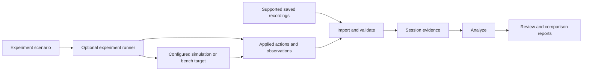

# Architecture direction

This is a conceptual design for the documented product scope. There is no
implementation yet, and no language, framework, application shell, parser library
or storage format has been selected. Responsibilities below do not prescribe
packages, services or a plugin framework.

## Shared analysis, optional experiment execution

The runner produces evidence for the same analyzer rather than a second
investigation interface. File analysis has no operational dependency on the
runner. Shared responsibilities can initially live in one application process;
process boundaries should follow demonstrated needs.

## Responsibilities

| Responsibility | Proposed contract |
| --- | --- |
| Import | Identify a supported format and its version, validate the input and retain its origin. Unsupported or damaged input produces an explicit outcome. |
| Session evidence | Preserve source identity, original ordering, timestamps with their meaning, decoded observations and references to original records. |
| Analysis | Select sources and intervals, inspect measurements/events and compare recorded observations without changing their meaning. |
| Experiment execution | Apply the declared scenario to the selected test path and record actual actions, observations, termination and failures. |
| Reports | Present observations and limitations with links back to their sources; distinguish complete, partial and failed runs. |

The event schema remains open. Its required fields will depend on the first
supported recording format and experiment trace.

## Evidence conventions

- **Source identity:** retain recording identity and any available vehicle,
  component and stream identity. A decoder also needs compatible message
  definitions; an identifier is not a substitute for the selected dialect.
- **Time:** retain both the original value and its meaning. Capture time,
  device time and local receipt time are different observations. A timestamp
  without a known clock relationship must not be silently aligned with another
  source. Missing synchronization leaves an explicit limit on comparison.
- **Original data:** preserve input bytes. Derived values and annotations refer
  back to source records and identify how they were calculated.
- **Experiment actions:** distinguish the planned perturbation, the action
  actually applied at a named point, and an effect observed elsewhere. A configured
  delay is not a measured end-to-end delay; a drop count at a proxy does not
  describe all losses in a physical link.
- **Completion:** record whether a run completed, stopped or failed, including
  late recording errors. A partial trace remains inspectable with that status.
- **Interpretation:** label inferences. Nearby timestamps do not by themselves
  establish causality, and an acknowledgement alone does not establish the
  intended physical outcome of an action.

MAVLink's [packet format](https://mavlink.io/en/guide/serialization.html) describes
message identity and decoding conventions. Its
[time synchronization protocol](https://mavlink.io/en/services/timesync.html)
and [command protocol](https://mavlink.io/en/services/command.html) are primary
references for timing and acknowledgement semantics. These references guide
implementation decisions; they do not establish support in this project.

## Input boundaries

| Input category | Current status |
| --- | --- |
| MAVLink recordings | First importer candidate; precise container, dialect and timestamp interpretation remain to be selected. |
| Onboard flight logs | Possible later integration; no formats selected or implemented. |
| Video and associated timing | Intended analysis capability; encoding and synchronization support remain open. |
| Experiment traces | Intended shared input; format will follow the first implemented experiment. |
| ARGOS recordings | Possible adapter; core analysis remains independent of ARGOS. |

Different input adapters may describe different observations. Converting them
into one interface must not invent missing fields or equate their timing and
measurement semantics. An initial importer does not imply all UAVs are supported.

## Decisions for the first implementation

The initial release needs one documented recording format, a redistributable
fixture, a parser/dialect boundary, a usable interface and a supported runtime.
The web, desktop or CLI interface choice remains open. The release documentation
will describe the selected formats, design rationale and installation procedure.

See the [first milestone proposal](first-milestone.md) for a candidate scope,
and the [mode workflows](workflows.md) for the intended user experience.
