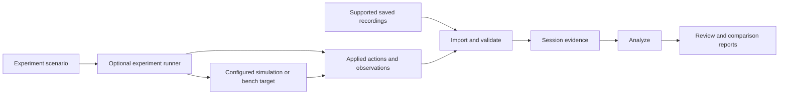

# Architecture direction

This is a conceptual design for the documented product scope. There is no
implementation yet. The starting stack below is a recommendation, not a verified
implementation or a finalized compatibility commitment. Responsibilities below
do not prescribe separate services or a plugin framework.

## Shared analysis, optional experiment execution

The runner produces evidence for the same analyzer rather than a second
investigation interface. File analysis has no operational dependency on the
runner. Shared responsibilities can initially live in one application process;
process boundaries should follow demonstrated needs.

## Responsibilities

| Responsibility | Proposed contract |
| --- | --- |
| Import | Identify a supported format and its version, validate the input and retain its origin. Unsupported or damaged input produces an explicit outcome. |
| Session evidence | Preserve source identity, original ordering, timestamps with their meaning, decoded observations and references to original records. |
| Analysis | Select sources and intervals, inspect measurements/events and compare recorded observations without changing their meaning. |
| Experiment execution | Apply the declared scenario to the selected test path and record actual actions, observations, termination and failures. |
| Reports | Present observations and limitations with links back to their sources; distinguish complete, partial and failed runs. |

The event schema remains open. Its required fields will depend on the first
supported recording format and experiment trace.

## Evidence conventions

- **Source identity:** retain recording identity and any available vehicle,
  component and stream identity. A decoder also needs compatible message
  definitions; an identifier is not a substitute for the selected dialect.
- **Time:** retain both the original value and its meaning. Capture time,
  device time and local receipt time are different observations. A timestamp
  without a known clock relationship must not be silently aligned with another
  source. Missing synchronization leaves an explicit limit on comparison.
- **Original data:** preserve input bytes. Derived values and annotations refer
  back to source records and identify how they were calculated.
- **Experiment actions:** distinguish the planned perturbation, the action
  actually applied at a named point, and an effect observed elsewhere. A configured
  delay is not a measured end-to-end delay; a drop count at a proxy does not
  describe all losses in a physical link.
- **Completion:** record whether a run completed, stopped or failed, including
  late recording errors. A partial trace remains inspectable with that status.
- **Interpretation:** label inferences. Nearby timestamps do not by themselves
  establish causality, and an acknowledgement alone does not establish the
  intended physical outcome of an action.

MAVLink's [packet format](https://mavlink.io/en/guide/serialization.html) describes
message identity and decoding conventions. Its
[time synchronization protocol](https://mavlink.io/en/services/timesync.html)
and [command protocol](https://mavlink.io/en/services/command.html) are primary
references for timing and acknowledgement semantics. These references guide
implementation decisions; they do not establish support in this project.

## Input boundaries

| Input category | Current status |
| --- | --- |
| MAVLink recordings | Proposed v0.1 profile: QGroundControl-style timestamped logs, unsigned MAVLink 1/2, `common` dialect; no implemented support. |
| Onboard flight logs | Possible later integration; no formats selected or implemented. |
| Video and associated timing | Intended analysis capability; encoding and synchronization support remain open. |
| Experiment traces | Intended shared input; format will follow the first implemented experiment. |
| ARGOS recordings | Possible adapter; core analysis remains independent of ARGOS. |

Different input adapters may describe different observations. Converting them
into one interface must not invent missing fields or equate their timing and
measurement semantics. An initial importer does not imply all UAVs are supported.

## Recommended starting stack

These choices target the [proposed v0.1 workflow](first-milestone.md); dependency
versions and runtime compatibility still require implementation-time validation.

| Concern | Recommendation | Reason |
| --- | --- | --- |
| Runtime | Python 3.12; Linux as the initial validation target | One runtime for decoding, analysis, interface and tests. |
| Frame decoding | Pinned `pymavlink`, explicit `common` dialect | Reuse MAVLink message definitions and checksum handling. |
| Interface | Streamlit served on `127.0.0.1` | Local file selection, filters, record inspection and download in one application. |
| Timeline | Plotly with explicit source/type/time controls | Interactive activity plots without coupling filtering to chart zoom events. |
| Session data | Python data structures in memory | One recording per browser session; persistence needs are initially limited to report export. |
| Report | Markdown download | Readable evidence summary with source fingerprints and record references. |
| Environment and checks | `pyproject.toml`, `uv.lock`, pytest and Ruff | Reproducible dependencies, behavioral tests and basic source checks. |

Streamlit runs the Python backend on the host and presents the interface in a
browser. For this release both run on the same machine. Configure its listener
for loopback and disable usage statistics; bundle required display assets and
verify operation without external networking after installation. See
[Streamlit architecture](https://docs.streamlit.io/develop/concepts/architecture/architecture)
and [configuration](https://docs.streamlit.io/develop/api-reference/configuration/config.toml).

Keep four concrete responsibilities within one Python package: reading the
recording container, representing imported evidence, querying that evidence,
and presenting/exporting results. The first three must be callable without
Streamlit. Read input bytes through a file-only boundary and use the generated
MAVLink decoder directly; user input must not reach a factory that also opens
network or serial transports. See the
[pymavlink guide](https://mavlink.io/en/mavgen_python/).

For this input, retain the recording fingerprint and raw bytes, original record
ordinal and byte range, capture timestamp and declared clock convention, frame
identity, decoded fields and per-record issues. Keep traversal completion
separate from decoding coverage and integrity/authenticity status. Tables and
plots are derived views; device-time fields do not silently replace capture time.

Streamlit reruns application code on interaction. Retain an import result in
browser-session state so changing filters does not parse the file again. Inputs
and decoded data occupy memory, so capacity must be bounded and measured before
release. Plot selections can drive inspection, while explicit interval controls
remain the source of filter state. See [execution and caching](https://docs.streamlit.io/develop/concepts/architecture/caching)
and [Plotly selections](https://docs.streamlit.io/develop/api-reference/charts/st.plotly_chart).

This approach favors a small navigable analyzer. A CLI with static output is an
alternative for batch reports; an API and custom web frontend would become
useful if richer coordinated interactions or synchronized video justify them.
Database storage, native packaging and separate execution services would follow
demonstrated needs. The first implementation does not need to define the future
Experiment schema or create unused adapters.

Lock concrete dependency versions when implementing and validate installation
against that lock. `uv` supports refusing implicit lock changes via `--locked`;
see [locking and syncing](https://docs.astral.sh/uv/concepts/projects/sync/).
Project and fixture licensing remain open release decisions.

See the [first milestone proposal](first-milestone.md) for a candidate scope,
and the [mode workflows](workflows.md) for the intended user experience.
