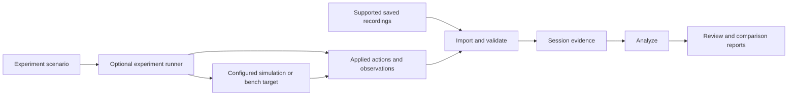

# Architecture direction

This document combines the product architecture direction with the first
implemented boundary: a Python file importer, in-memory evidence, exact filters,
activity and attitude plots, record inspection, Markdown reports and a JSON command. See
the [Analyze guide](analyze.md) and [importer guide](importer.md) for current use.
Experiment execution and cross-session comparison remain future work; the diagram
below describes the intended complete workflow.

## Shared analysis, optional experiment execution

The runner produces evidence for the same analyzer rather than a second
investigation interface. File analysis has no operational dependency on the
runner. Shared responsibilities can initially live in one application process;
process boundaries should follow demonstrated needs.

## Responsibilities

| Responsibility | Proposed contract |
| --- | --- |
| Import | Identify a supported format and its version, validate the input and retain its origin. Unsupported or damaged input produces an explicit outcome. |
| Session evidence | Preserve source identity, original ordering, timestamps with their meaning, decoded observations and references to original records. |
| Analysis | Select sources and intervals, inspect measurements/events and compare recorded observations without changing their meaning. |
| Experiment execution | Apply the declared scenario to the selected test path and record actual actions, observations, termination and failures. |
| Reports | Present observations and limitations with links back to their sources; distinguish complete, partial and failed runs. |

The importer now represents file bytes, decoded records and import issues in
`ImportResult`, `Record` and `ImportIssue`. This concrete recording model does
not define the future experiment-event schema.

## Evidence conventions

- **Source identity:** retain recording identity and any available vehicle,
  component and stream identity. A decoder also needs compatible message
  definitions; an identifier is not a substitute for the selected dialect.
- **Time:** retain both the original value and its meaning. Capture time,
  device time and local receipt time are different observations. A timestamp
  without a known clock relationship must not be silently aligned with another
  source. Missing synchronization leaves an explicit limit on comparison.
- **Original data:** preserve input bytes. Derived values and annotations refer
  back to source records and identify how they were calculated.
- **Experiment actions:** distinguish the planned perturbation, the action
  actually applied at a named point, and an effect observed elsewhere. A configured
  delay is not a measured end-to-end delay; a drop count at a proxy does not
  describe all losses in a physical link.
- **Completion:** record whether a run completed, stopped or failed, including
  late recording errors. A partial trace remains inspectable with that status.
- **Interpretation:** label inferences. Nearby timestamps do not by themselves
  establish causality, and an acknowledgement alone does not establish the
  intended physical outcome of an action.

MAVLink's [packet format](https://mavlink.io/en/guide/serialization.html) describes
message identity and decoding conventions. Its
[time synchronization protocol](https://mavlink.io/en/services/timesync.html)
and [command protocol](https://mavlink.io/en/services/command.html) are primary
references for timing and acknowledgement semantics. Only the documented file
import profile is implemented; time synchronization and commands are not.

## Input boundaries

| Input category | Current status |
| --- | --- |
| MAVLink recordings | Implemented bounded QGroundControl-style timestamped profile, unsigned MAVLink 1/2, pinned `common` dialect; checked with synthetic inputs and [one public producer recording](recording-validation.md) with partial decoding coverage. |
| Onboard flight logs | Possible later integration; no formats selected or implemented. |
| Video and associated timing | Intended analysis capability; encoding and synchronization support remain open. |
| Experiment traces | Intended shared input; format will follow the first implemented experiment. |
| ARGOS recordings | Possible adapter; core analysis remains independent of ARGOS. |

Different input adapters may describe different observations. Converting them
into one interface must not invent missing fields or equate their timing and
measurement semantics. An initial importer does not imply all UAVs are supported.

## Recommended starting stack

These choices implement the [v0.1 workflow](first-milestone.md). Python 3.12,
pymavlink 2.4.49, Streamlit 1.63.0, Plotly 7.0.0, in-memory records, uv, pytest
and Ruff are in use. Playwright is an optional browser-test dependency.

| Concern | Implementation | Reason |
| --- | --- | --- |
| Runtime | Python 3.12; importer verified on Linux x86_64 | One runtime for decoding, analysis and the intended interface. |
| Frame decoding | Pinned `pymavlink`, explicit `common` dialect | Reuse MAVLink message definitions and checksum handling. |
| Interface | Streamlit served on `127.0.0.1` | Local file selection, filters, record inspection and download in one application. |
| Timeline | Plotly with explicit source/type/time controls | Activity and attitude plots with point-to-record inspection; zoom does not change filters. |
| Session data | Python data structures in memory | One recording per browser session; persistence needs are initially limited to report export. |
| Report | Markdown download | Readable evidence summary with source fingerprints and record references. |
| Environment and checks | `pyproject.toml`, `uv.lock`, pytest and Ruff | Reproducible dependencies, behavioral tests and basic source checks. |

Streamlit runs the Python backend on the host and presents the interface in a
browser. For this release both run on the same machine. Configure its listener
for loopback and disable usage statistics; bundle required display assets and
verify operation without external networking after installation. See
[Streamlit architecture](https://docs.streamlit.io/develop/concepts/architecture/architecture)
and [configuration](https://docs.streamlit.io/develop/api-reference/configuration/config.toml).

Keep four concrete responsibilities within one Python package: reading the
recording container, representing imported evidence, querying that evidence,
and presenting/exporting results. The first three must be callable without
Streamlit. Read input bytes through a file-only boundary and use the generated
MAVLink decoder directly; user input must not reach a factory that also opens
network or serial transports. See the
[pymavlink guide](https://mavlink.io/en/mavgen_python/).

`analysis.py` applies inclusive integer-time filters in file order. It segments
the clock at regressions in the complete input before finding observation
intervals; a filter cannot hide a reset and create a false elapsed duration.
`telemetry.py` extracts a single source's selected ATTITUDE observations, retaining
record references, original radians and capture-clock segments. It permits at
most 5,000 records per plot and exposes explicit empty, multiple-source and
capacity outcomes. Unavailable field values remain gaps. `charts.py` counts all
selected observations in at most 200 activity bins and plots the three attitude
angles without decimation. Connecting lines break at clock discontinuities,
unavailable values, angle jumps greater than π and the user-selected maximum
capture-time interval. This threshold is a display setting, not a diagnosis.
The Streamlit
presentation pages records and issues rather than transferring an entire dense
recording to the browser. `report.py` exports provenance, applied filters,
coverage, interval references, attitude plot settings, global import issues and explicitly inspected
record details without depending on Streamlit.

For this input, retain the recording fingerprint and raw bytes, original record
ordinal and byte range, capture timestamp and declared clock convention, frame
identity, decoded fields and per-record issues. Keep traversal completion
separate from decoding coverage and integrity/authenticity status. Tables and
plots are derived views; device-time fields do not silently replace capture time.

Streamlit reruns application code on interaction. Retain an import result in
browser-session state so changing filters does not parse the file again. Inputs
and decoded data occupy memory, so capacity must be bounded and measured before
release. The Record control or an attitude point selection chooses the inspected
message; point selection also navigates to its table page. Plot widgets are keyed
by recording, applied filters and line-gap setting so stale events cannot attach
an earlier point to a new view. Explicit interval controls remain the source of
filter state. Plot zoom only changes the display.
See [execution and caching](https://docs.streamlit.io/develop/concepts/architecture/caching)
and [Plotly charts](https://docs.streamlit.io/develop/api-reference/charts/st.plotly_chart).

This approach provides a small navigable analyzer alongside the JSON inspection
command. An API and custom web frontend would become
useful if richer coordinated interactions or synchronized video justify them.
Database storage, native packaging and separate execution services would follow
demonstrated needs. The first implementation does not need to define the future
Experiment schema or create unused adapters.

Lock concrete dependency versions when implementing and validate installation
against that lock. `uv` supports refusing implicit lock changes via `--locked`;
see [locking and syncing](https://docs.astral.sh/uv/concepts/projects/sync/).
The source distribution uses an explicit public-file inclusion list. Project
and fixture licensing remain open release decisions.

See the [first milestone proposal](first-milestone.md) for a candidate scope,
and the [mode workflows](workflows.md) for the intended user experience.
