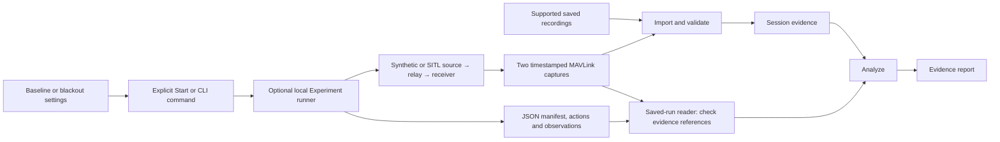

# Architecture

The **0.2.0** source checkout implements a Python file importer,
in-memory evidence, exact filters, activity and attitude plots, record inspection,
Markdown reports and a JSON command. The Experiment interface and CLI add a bounded synthetic
local UDP path and save captures for those same analysis components. See the
[Analyze guide](analyze.md), [importer guide](importer.md) and
[Experiment guide](experiment.md) for current use. A pinned [ArduCopter SITL profile](sitl.md) adds one external local source;
a bounded [saved baseline/blackout comparison](comparison.md) reuses the same
validated evidence. Broader integrations remain future work.

The source checkout additionally provides the [Instrument workspace](instrument.md),
a custom local interface currently limited to the bundled recording, source
selection and attitude observations. The complete Streamlit interface remains
available during migration. Instrument is not part of the published v0.2.0
artifacts.

## Shared analysis, optional experiment execution

```mermaid
flowchart LR
    files["Supported saved recordings"] --> import["Import and validate"]
    import --> session["Session evidence"]
    session --> analyze["Analyze"]
    analyze --> report["Evidence report"]
    scenario["Baseline or blackout settings"] --> launch["Explicit Start or CLI command"]
    launch --> runner["Optional local Experiment runner"]
    runner --> path["Synthetic or SITL source → relay → receiver"]
    path --> captures["Two timestamped MAVLink captures"]
    captures --> import
    runner --> trace["JSON manifest, actions and observations"]
    trace --> saved["Saved-run reader: check evidence references"]
    captures --> saved
    saved --> analyze
```

The runner's two captures use the existing import profile. Analyze opens an
individual recording or [one saved experiment](saved-experiments.md). The latter
checks manifest, trace and capture references without importing execution modules.
Its run timeline uses observed monotonic stamps; capture plots retain their
original wall-clock meaning. No clock conversion or cross-run alignment is inferred. File analysis has no operational dependency
on the runner. An explicit Experiment CLI command or browser **Start experiment**
starts the local sender and relay; file opening and presentation reruns do not.

## Responsibilities

| Responsibility | Current contract |
| --- | --- |
| Import | Identify a supported format and its version, validate the input and retain its origin. Unsupported or damaged input produces an explicit outcome. |
| Session evidence | Preserve source identity, original ordering, timestamps with their meaning, decoded observations and references to original records. |
| Analysis | Select sources and intervals, inspect recorded measurements and preserve original meaning. Compare eligible saved runs on an explicit common measurement-relative window. |
| Experiment execution | Own one explicitly launched browser worker per server, or a CLI run; apply the scenario and record actual actions, observations, termination and failures. Controller requests retain separate evidence and clocks. |
| Reports | Present imported observations and limitations with references to their sources. Saved-run reports also distinguish declared outcome, evidence consistency, requested settings, applied gate intervals and observations. |

The importer now represents file bytes, decoded records and import issues in
`ImportResult`, `Record` and `ImportIssue`. This concrete recording model does
not depend on the runner's JSON event schema.

## Instrument presentation boundary

`instrument.py` serves packaged HTML, CSS and JavaScript through Starlette and
Uvicorn on loopback. Its fixed `/api/example` request reads the installed
synthetic recording and calls the existing importer, `build_attitude_view` and
`attitude_chart`. The browser owns the displayed recording and selected source;
the server maintains no mutable recording session or execution controller.
No upload, arbitrary path reader or Experiment execution endpoint is exposed.

The schema version 1 payload preserves provenance, original capture timestamps,
import issues and chart point references. Exact capture timestamps cross the
JSON boundary as decimal strings. Relative plot coordinates are display numbers
and never replace original evidence. The frontend changes appearance and source
selection; the existing Python modules own import and chart interpretation.

Fonts and Lucide icons are distributed with the interface, including their
license texts. The installed Plotly package supplies its local JavaScript
bundle. No runtime CDN is required. Optional navigation to a separately started
full workspace uses a configured loopback port and transfers no recording state
or execution command. See the [Instrument guide](instrument.md) for routes,
launcher options and the current workflow boundary.

## Saved-run analysis boundary

`saved_run.py` reads fixed, bounded artifact names, retains bytes and fingerprints,
validates trace clocks and capture references, and preserves usable prefixes with
issues. It uses the existing importer and has no dependency on `experiment.py`,
`sitl.py`, subprocesses or network transports. `run_report.py` builds a bounded
Markdown summary and can append the existing selected-capture report.
`run_view.py` presents uploaded directory evidence, a within-run activity timeline
and paged trace references. `app.py` reuses the ordinary capture filters and
inspector for either observation point. A changed run or point invalidates the
previous selection; unreadable replacement evidence removes the previous export.

## Saved-run comparison boundary

`comparison.py` consumes two validated `SavedRun` values. It checks source/profile
compatibility, production lifecycle consistency and stop coverage before selecting
observations on a
common half-open window relative to each measurement origin. It retains original
references, computes counts/rates/intervals and projects actual gate timing.
`comparison_report.py` preserves both runs and bounded evidence in Markdown;
`comparison_view.py` owns two directory uploads, selectors and shared activity bins.
Blocked comparisons retain reasons and provenance without invented metrics.
These modules import neither execution code nor telemetry transports.

## Local catalog boundary

The file-only catalog reads declared manifest metadata under the configured
`--experiment-root`. It recognizes a CLI evidence directory directly below the
root or the `evidence` child of a browser run container. It does not traverse
arbitrary directory trees, load captures during listing, write an index or infer
process state from old controller files.

The scan is bounded to 200 direct children, 1 MiB per manifest and 8 MiB of
manifest bytes in total; truncation remains visible. Entering **Local experiments**
and **Refresh catalog** produce metadata snapshots. Explicit opening or
comparison reads the selected files through the saved-run validator before
passing them to the existing Analyze views. Declared `running` entries remain
unfinalized and cannot be opened through the catalog. Retained files remain
independent of the server's transient execution history.

See [local browsing](saved-experiments.md#browse-local-experiments) for layouts,
failure states and the distinction between metadata and validated observations.

## Browser execution boundary

`experiment_view.py` is loaded only in Experiment mode. A module-level
`ExperimentController` in `experiment_control.py` serializes starts across
browser sessions and owns the worker independently of Streamlit reruns. A
background monitor handles worker exit, deadlines and reaping; the latest
20 run snapshots remain in server memory. History eviction and server restart
do not delete saved outputs, discover older runs or restart execution.
Explicit catalog browsing is independent of this controller and does not restore
its history or claim ownership of earlier processes.

The UI polls controller snapshots through a 0.5-second
[Streamlit fragment](https://docs.streamlit.io/develop/api-reference/execution-flow/st.fragment)
while its session is active. It displays process state and controller elapsed
time without reading changing captures or claiming live observation counts.
Browser closure or mode changes do not own the worker lifetime. Each terminal
handoff calls the existing saved-file reader and transfers validated `SavedRun`
values into Analyze; inspection and comparison remain execution-independent.

`experiment_worker.py` receives a fixed argument list, without a shell. Its
stdin ownership pipe requests interruption on Stop or parent exit. The controller
uses a duration/startup allowance plus eight seconds, then a five-second cleanup
allowance before forced termination. Normal server shutdown waits for owned
cleanup. These deadlines are not real-time guarantees under process suspension
or blocked I/O. A missing or unfinalized runner outcome remains explicit.

For SITL, the controller launches the worker through `unshare` in dedicated
user, network and PID namespaces; the worker enables only loopback and is PID 1.
Its death removes remaining processes in that PID namespace, including the
simulator's separate process group. The server retains its own network namespace
and listener. Saved simulator PIDs are local to the worker's namespace. See
[unshare](https://man7.org/linux/man-pages/man1/unshare.1.html) and
[PID namespaces](https://man7.org/linux/man-pages/man7/pid_namespaces.7.html).

Each browser launch creates `run-<identifier>/control.json` and a fresh
`evidence/` directory. Controller requests, process outcomes and a bounded
8,192-byte stderr tail are separate from the unchanged runner files. Controller
and runner lifecycle values never replace consistency checks in Analyze. See
the [Experiment interface guide](experiment-ui.md) for state and clock meanings.

## Local execution boundary

`experiment.py` owns configuration validation, the synthetic MAVLink encoder,
loopback UDP sockets, selector scheduling, capture writing, JSON evidence
and shutdown. The synthetic sender, relay and receiver share one process. For the SITL
profile, `sitl.py` launches one verified native subprocess with its own working
directory and process group, and requires a loopback-only network namespace.
Startup readiness and the measured phase have separate timing; original
datagrams, including the pinned startup preamble, are retained before framing. The relay input is
observed before its forwarding/drop decision; the receiver is observed only
after an actual socket read. Captures preserve original datagram frame bytes.
No network or serial transport factory is exposed to file analysis.

The runner schedules using monotonic nanoseconds and records elapsed time from
the run origin. The blackout's requested duration sets a deadline relative to
its actual disable action, while the overall measurement deadline stays bounded.
An orderly stop can reopen the gate early and retains an interrupted outcome.
The comparator checks the actual interval against the saved requested duration;
it does not infer gate timing from settings. Capture timestamps use host
wall-clock Unix microseconds sampled after the read. The synthetic payload's
`time_boot_ms` is sender elapsed time;
it stays separate from those capture clocks. Requested gate timing, actual gate
transitions and socket observations are different evidence. The implementation
does not measure kernel receive timestamps or infer exact transport latency.

The output directory is exclusive to one run. `run.json` records settings,
versions, endpoints, outcome, counters and fingerprints; `actions.jsonl` records
application decisions, and `observations.jsonl` links reads to their captures.
Normal completion or catchable termination stops production, drains local
datagrams for a bounded interval and closes resources. A failure to finalize
evidence cannot establish successful completion. The
[Experiment guide](experiment.md) defines the public contract and limitations.

## Evidence conventions

- **Source identity:** retain recording identity and any available vehicle,
  component and stream identity. A decoder also needs compatible message
  definitions; an identifier is not a substitute for the selected dialect.
- **Time:** retain both the original value and its meaning. Capture time,
  device time and local receipt time are different observations. A timestamp
  without a known clock relationship must not be silently aligned with another
  source. Missing synchronization leaves an explicit limit on comparison.
- **Original data:** preserve input bytes. Derived values and annotations refer
  back to source records and identify how they were calculated.
- **Experiment actions:** distinguish the planned perturbation, the action
  actually applied at a named point, and an effect observed elsewhere. A configured
  delay is not a measured end-to-end delay; a drop count at a proxy does not
  describe all losses in a physical link.
- **Completion:** record whether a run completed, stopped or failed, including
  late recording errors. A partial trace remains inspectable with that status.
- **Interpretation:** label inferences. Nearby timestamps do not by themselves
  establish causality, and an acknowledgement alone does not establish the
  intended physical outcome of an action.

MAVLink's [packet format](https://mavlink.io/en/guide/serialization.html) describes
message identity and decoding conventions. Its
[time synchronization protocol](https://mavlink.io/en/services/timesync.html)
and [command protocol](https://mavlink.io/en/services/command.html) are primary
references for timing and acknowledgement semantics. The implemented file
profile and synthetic runner do not implement time synchronization or commands.

## Input boundaries

| Input category | Current status |
| --- | --- |
| MAVLink recordings | Implemented bounded QGroundControl-style timestamped profile, unsigned MAVLink 1/2, pinned `common` dialect; checked with synthetic inputs and [one public producer recording](recording-validation.md) with partial decoding coverage. |
| Onboard flight logs | Possible later integration; no formats selected or implemented. |
| Video and associated timing | Intended analysis capability; encoding and synchronization support remain open. |
| Experiment captures and traces | Two local timestamped MAVLink captures feed the existing importer; Saved-run analysis validates the separate manifest/actions/observations and links them to both captures; raw datagrams support SITL references. |
| ARGOS recordings | Possible adapter; core analysis remains independent of ARGOS. |

Different input adapters may describe different observations. Converting them
into one interface must not invent missing fields or equate their timing and
measurement semantics. An initial importer does not imply all UAVs are supported.

## Implementation stack

The implementation retains Python 3.12, pymavlink 2.4.49, Streamlit 1.63.0,
Plotly 7.0.0, in-memory records, uv, pytest and Ruff. Instrument adds Starlette
1.7.0 and Uvicorn 0.53.0 with packaged HTML, CSS and JavaScript. Playwright is an optional
browser-test dependency. The [first milestone](first-milestone.md) documents
the original v0.1.0 Analyze scope.

| Concern | Implementation | Reason |
| --- | --- | --- |
| Runtime | Python 3.12; Linux x86_64 | One runtime for decoding, analysis, presentation and local execution. |
| Frame decoding | Pinned `pymavlink`, explicit `common` dialect | Reuse MAVLink message definitions and checksum handling. |
| Full interface | Streamlit served on `127.0.0.1` | Local file selection, filters, record inspection, downloads and explicit Experiment execution. |
| Instrument interface | Packaged HTML/CSS/JavaScript; Starlette and Uvicorn on `127.0.0.1` | Custom presentation with a bounded read-only connection to existing Python analysis. |
| Timeline | Plotly with explicit source/type/time controls | Activity and attitude plots with point-to-record inspection; zoom does not change filters. |
| Session data | Python data structures in memory; original experiment evidence on disk | Per-session recording/run/pair analysis and a shared bounded execution history, with no automatic recovery or execution on restart. |
| Report | Markdown download | Readable evidence summary with source fingerprints and record references. |
| Experiment | Standard-library sockets, selectors, subprocesses, clocks, signals and JSON; existing pinned MAVLink encoder | A bounded local path and explicitly owned browser worker; SITL additionally requires local Linux namespace tools. |
| Environment and checks | `pyproject.toml`, `uv.lock`, pytest and Ruff | Reproducible dependencies, behavioral tests and basic source checks. |

Streamlit runs the Python backend on the host and presents the interface in a
browser. The launcher binds to loopback and disables usage statistics; display
assets are bundled. Browser access can also use [SSH forwarding](analyze.md#access-through-ssh).
See [Streamlit architecture](https://docs.streamlit.io/develop/concepts/architecture/architecture)
and [configuration](https://docs.streamlit.io/develop/api-reference/configuration/config.toml).

File analysis has four responsibilities within one Python package: reading the
recording container, representing imported evidence, querying that evidence,
and presenting/exporting results. The first three are callable without
Streamlit. The importer reads bytes through a file-only boundary and uses the
generated MAVLink decoder directly; it does not call a factory that opens
network or serial transports. See the
[pymavlink guide](https://mavlink.io/en/mavgen_python/).

`analysis.py` applies inclusive integer-time filters in file order. It segments
the clock at regressions in the complete input before finding observation
intervals; a filter cannot hide a reset and create a false elapsed duration.
`telemetry.py` extracts a single source's selected ATTITUDE observations, retaining
record references, original radians and capture-clock segments. It permits at
most 5,000 records per plot and exposes explicit empty, multiple-source and
capacity outcomes. Unavailable field values remain gaps. `charts.py` counts all
selected observations in at most 200 activity bins and plots the three attitude
angles without decimation. Connecting lines break at clock discontinuities,
unavailable values, angle jumps greater than π and the user-selected maximum
capture-time interval. This threshold is a display setting, not a diagnosis.
The Streamlit
presentation pages records and issues rather than transferring an entire dense
recording to the browser. `report.py` exports provenance, applied filters,
coverage, interval references, attitude plot settings, global import issues and explicitly inspected
record details without depending on Streamlit.

For this input, retain the recording fingerprint and raw bytes, original record
ordinal and byte range, capture timestamp and declared clock convention, frame
identity, decoded fields and per-record issues. Keep traversal completion
separate from decoding coverage and integrity/authenticity status. Tables and
plots are derived views; device-time fields do not silently replace capture time.

Streamlit reruns application code on interaction. The app retains an import
result in browser-session state so changing filters does not parse the file again.
Input bytes and plot selections have explicit [capacity limits](analyze.md#input-and-capacity-boundaries);
those limits do not bound total process memory. The Record control or an attitude
point selection chooses the inspected message. Selecting an attitude point also
navigates to its table page. Plot widgets are keyed
by recording, applied filters and line-gap setting so stale events cannot attach
an earlier point to a new view. Explicit interval controls remain the source of
filter state. Plot zoom only changes the display.
See [execution and caching](https://docs.streamlit.io/develop/concepts/architecture/caching)
and [Plotly charts](https://docs.streamlit.io/develop/api-reference/charts/st.plotly_chart).

The full interface and JSON inspection command remain available while
Instrument gains additional workflows. Database storage, native packaging and
separate execution services would follow
demonstrated needs. The local Experiment schema covers the implemented path;
unused adapters and a general target framework are outside this increment.

Dependency versions are pinned in `uv.lock`. Installation uses `--locked` to
reject implicit lock changes; see
[locking and syncing](https://docs.astral.sh/uv/concepts/projects/sync/).
The source distribution uses an explicit public-file inclusion list. The
project's original code, documentation and synthetic fixture use the
[MIT License](../LICENSE). Source and wheel distributions include the license
text, [third-party notices](../THIRD_PARTY_NOTICES.md) and the explicitly declared
Instrument browser assets and their license texts; dependencies and vendored
assets retain their own terms.

See the [first milestone](first-milestone.md) for the published Analyze scope,
and the [mode workflows](workflows.md) for current and intended user experience.
