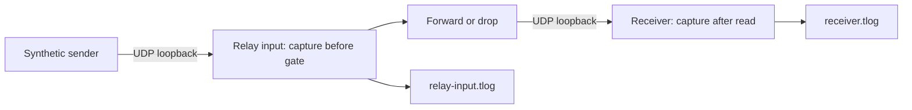

# Run a local Experiment

The first Experiment CLI sends synthetic MAVLink messages through a local UDP
relay to a receiver. It supports a baseline and a run with a two-second
interruption in relay forwarding. Both observation points produce saved files
for the existing Analyze workflow.

This feature is **unreleased**, in development version **0.2.0.dev0**. The
published v0.1.0 contains offline Analyze; use the current source checkout for
Experiment. The initial target is Linux with Python 3.12. No simulator or
vehicle is involved.

## Run the baseline and interruption

From the repository root, install the locked dependencies and run:

```sh
uv sync --locked
uv run --locked uav-debugger-experiment --output local/experiments/baseline --scenario baseline
uv run --locked uav-debugger-experiment --output local/experiments/blackout --scenario blackout
```

Each command runs for six seconds by default, then drains pending local
datagrams for at most 0.2 seconds and closes its sockets and files. Choose a new
output directory for every run: an existing directory is rejected, including
an empty one. The parent directories are created as needed. `local/` is ignored
by Git in this repository.

The module entry point is equivalent:

```sh
uv run --locked python -m uav_debugger.experiment --output local/experiments/another-baseline --scenario baseline
```

| Option | Meaning |
| --- | --- |
| `--output PATH` | Required new directory for this run's evidence. |
| `--scenario baseline` | Forward each datagram observed at the relay input; the default scenario. |
| `--scenario blackout` | Suppress forwarding during one two-second gate interval; continue observing the relay input. |
| `--duration SECONDS` | Run duration, default `6`; accepted range `0.1`–`60` seconds. |
| `--blackout-at SECONDS` | Requested gate activation time relative to run start; blackout only, default `2`. At least `0.1` second must remain before and after the requested two-second interval. |

The sender requests 20 messages per second and generates unsigned MAVLink 2
`ATTITUDE` frames from system/component `1 / 1`, using the pinned `common`
definitions from `pymavlink==2.4.49`. The smooth angle values are synthetic,
deterministic functions of sender elapsed time. They are not a flight model or
measurements. `roll`, `pitch` and `yaw` use radians, and angular rates use radians
per second, following the
[MAVLink ATTITUDE definition](https://mavlink.io/en/messages/common.html#ATTITUDE).
Missed scheduling slots are counted and skipped instead of producing a burst
of delayed messages. The 60-second maximum allows at most 1,200 generated frames.

## Topology and interruption semantics



One process runs the sender, relay and receiver through a selector loop. Four
connected UDP sockets use `127.0.0.1` and ephemeral ports: sender, relay input,
relay output and receiver. The run records the actual endpoint addresses. There
is no user-selectable remote address, external target or listening service.
The two legs exchange real datagrams through the local kernel; they are not
independently scheduled processes or separate machines.

The relay records every datagram it reads before deciding whether to forward
it. Forwarding retains the exact frame bytes. While the blackout gate is active,
it records the drop action and does not forward or queue that datagram for
later replay. The receiver records only datagrams it actually reads. A
successful send establishes that the local kernel accepted the datagram; only
the receiver capture establishes observation at the receiver.

Scheduling uses the process's monotonic clock. The blackout requests activation
at `--blackout-at`, then holds the gate for two seconds from the actual activation.
Gate transitions and individual forwarding/drop decisions are recorded at their
actual application times. Scheduling delays can move either transition; this is
not a real-time runner. The run deadline remains bounded. A run that reaches
its deadline without finishing its requested gate interval is marked failed,
rather than extending indefinitely or claiming completion.

## Evidence files

| File | Evidence |
| --- | --- |
| `run.json` | Requested configuration, application/decoder versions, topology, clock descriptions, run outcome, counters and output fingerprints. |
| `actions.jsonl` | Actual lifecycle, sender sends, relay forwarding/drop decisions and gate transitions. One JSON object per line. |
| `observations.jsonl` | Actual socket-read observations at the relay input and receiver, with point identity, record/byte references, frame hashes and clocks. One JSON object per line. |
| `relay-input.tlog` | Frames actually read at the relay input, before the forwarding decision. |
| `receiver.tlog` | Frames actually read at the receiver, after the relay. |

Each capture follows the existing `qgc-timestamped-mavlink-v1` profile: an
eight-byte big-endian Unix-microsecond timestamp followed by one original
MAVLink frame. The filename does not identify a QGroundControl producer: these
files are produced by the local synthetic runner. Observation entries identify
their capture through `point`, with a zero-based `record_index` and `offset`
for the outer timestamp. `frame_size_bytes` excludes that eight-byte timestamp;
the frame starts at `offset + 8` and ends exclusively at
`offset + 8 + frame_size_bytes`. Analyze exposes those same record/frame ranges.

Requested settings do not prove the gate was applied. Actions record what the
runner did; observations record what arrived at a named point. Frame hashes
and capture references support inspection without treating a wrapping MAVLink
sequence number as a globally unique identity. The JSON files are separate
evidence; Analyze currently opens the `.tlog` files only and does not import or
align the action trace.

## Clocks

| Clock | Meaning and use |
| --- | --- |
| `monotonic_ns` | Local host monotonic nanoseconds sampled for execution events; used for deadlines and gate scheduling. Its origin is unspecified. |
| `elapsed_ns` | The event's monotonic time minus the run's monotonic origin. This relates events within this run. |
| `unix_us` | Host wall-clock Unix microseconds sampled for an event. For observations, it is sampled after the socket read and supplies the capture's outer timestamp. It is a user-space observation time, not kernel arrival time. |
| MAVLink `time_boot_ms` | Synthetic sender milliseconds since this run started. It is a payload field, not the receiver clock or a real vehicle boot time. |

Wall and monotonic clock samples are separate operations. Their stored values
do not establish exact clock alignment or one-way transport latency. Host wall
time can repeat or regress; original values remain in the captures and Analyze
retains its existing clock warnings and interval rules. Nanosecond/microsecond
units do not guarantee that resolution or accuracy. See Python's
[clock documentation](https://docs.python.org/3.12/library/time.html#time.monotonic_ns).

Two runs reuse the requested conditions but have different actual scheduling,
wall-clock timestamps and socket endpoints. They need not produce byte-identical
recordings or exactly the requested message count.

## Stop and outcome

Press `Ctrl+C` to request an orderly stop. `SIGTERM` uses the same cleanup path:
stop producing messages, reopen the gate if necessary, perform a bounded drain,
close resources and finalize the evidence. An early stop can therefore end a
blackout before its requested duration; the reopening action records `shutdown`
as its reason. The manifest distinguishes `running`, `completed`, `interrupted`
and `failed` outcomes. A terminated run retains the observations collected
before stopping; an interruption is not a completed scenario.

| Exit code | Outcome |
| --- | --- |
| `0` | Completed run. |
| `1` | Runtime or evidence-storage failure, including an unwritable destination. Inspect the error and retained evidence. |
| `2` | Invalid arguments or an existing output destination. |
| `130` | Interrupted by `SIGINT` (`Ctrl+C`). |
| `143` | Interrupted by `SIGTERM`. |

The bounded duration covers normal execution and the explicit drain, not a
hard real-time guarantee under process suspension or blocking filesystem I/O.
An uncatchable termination, process crash or storage failure can prevent
finalization. A manifest still marked `running` is not evidence of completion;
partial files may need the importer's retained-prefix handling.

## Inspect the recordings with Analyze

First check the captures through the file-only JSON command:

```sh
uv run --locked uav-debugger local/experiments/baseline/relay-input.tlog
uv run --locked uav-debugger local/experiments/baseline/receiver.tlog
uv run --locked uav-debugger local/experiments/blackout/relay-input.tlog
uv run --locked uav-debugger local/experiments/blackout/receiver.tlog
uv run --locked uav-debugger-analyze
```

In Analyze, open one `.tlog` at a time and select source **1 / 1** and message
type **ATTITUDE**. Inspect the message activity and attitude curves, click a
point or select **Record**, then download a report. The baseline should show
observations at both points throughout the run. In the blackout run, the relay
input continues observing messages while the receiver has an interval without
observations around the actual gate application. Analyze's default one-second
maximum line gap leaves that receiver interval disconnected.

Use the stored results to assess each run: requested 20 Hz and two seconds do
not imply an exact 40-message difference. Analyze time filters are relative to
the first observation in each opened file, not to the experiment run origin.
Separate reports and their capture fingerprints preserve those distinctions.
When Analyze runs through SSH, transfer captures to the browser computer before
uploading; see the [Analyze access guide](analyze.md#access-through-ssh).

Opening these files never starts or resumes Experiment. There is no Experiment
interface, automatic multi-file comparison, simulator integration, physical
link measurement or autopilot/failsafe validation in this increment. The
[verification guide](verification.md) records the checks actually performed.
